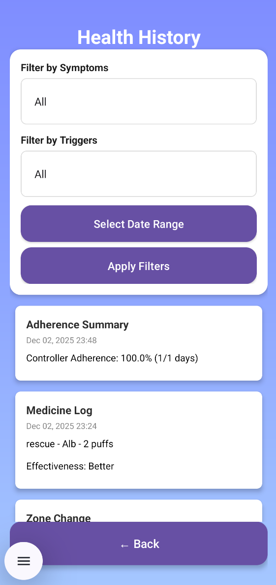
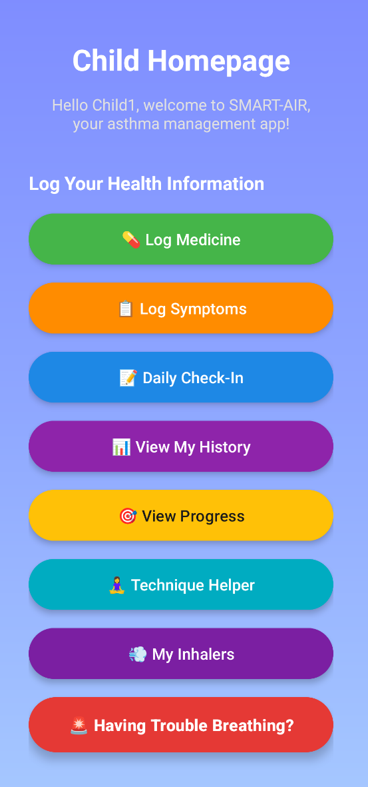
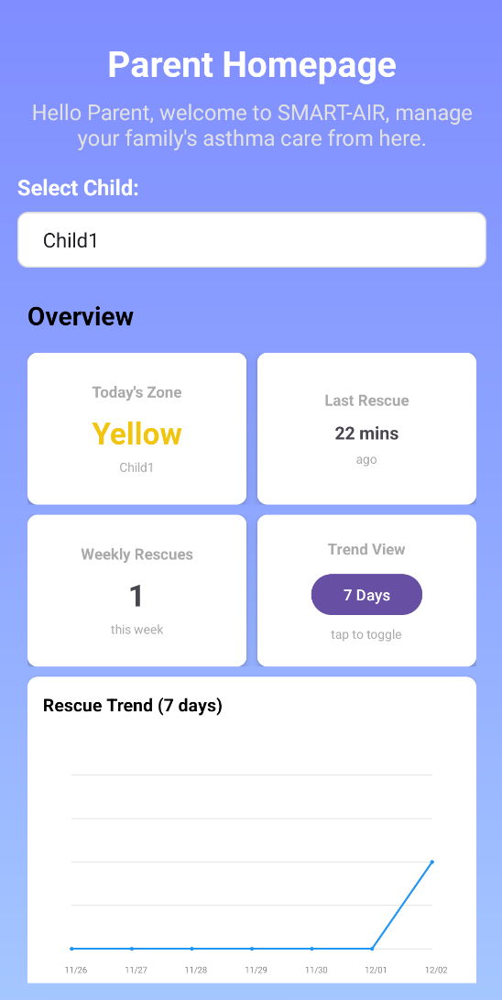
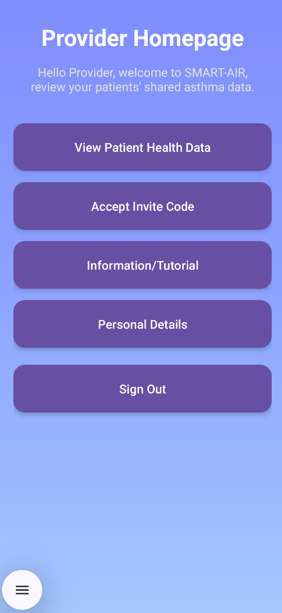

# SMART-AIR

A kid-friendly Android application that helps children (ages 6–16) understand and manage their asthma, while giving parents tools to track medicine use, symptoms, PEF zones, and safety alerts. Parents can selectively share their child's data with healthcare providers through exportable PDF/CSV reports.

## What It Does

SMART-AIR provides three user roles with different capabilities:

### Child Experience
- **Sign in** through username and password made by their parent
- **Daily check-ins** to monitor patterns (energy, breathing, sleep, mood, etc.)
- **Log medications** (rescue and controller) with pre/post "Better/Same/Worse" feelings
- **Animated Inhaler Technique Helper** with step-by-step video guidance
- **Motivation system** with badges and streaks for good technique and adherence
- **One-tap triage guidance** for breathing troubles with safety checks, and emergency contact
- **Enter peak-flow (PEF) values** with automatic zone calculation (Green/Yellow/Red) from PB

### Parent Experience
- **Create and manage** multiple children accounts
- **Dashboard view** showing:
  - Today's zone
  - Last rescue time
  - Weekly/Monthly rescue count
  - 7-day & 30-day trend snippets
- **Track medication inventory** (purchase date, expiry, remaining amount) with alerts
- **Configure controller schedule** for adherence tracking
- **Set Personal Best (PB)** for PEF zone calculations for child
- **Real-time alerts** for:
  - Red-zone days
  - Rapid rescue repeats (≥3 uses in 3 hours)
  - "Worse after dose" responses
  - Inventory expired/low (≤20%)
  - Triage escalations
- **View health history** with filtering by symptoms, triggers, and date range
- **Manage provider sharing** with granular toggles per data category
- **Export reports** as PDF/CSV for providers

### Provider Access (Read-Only)
- **View children's data** based on parent-given permissions
- **Access via 7-day invite code** from the parent
- **View shared categories:** vio granular toggles
  - Rescue logs
  - Controller adherence summary
  - Symptoms and triggers
  - Peak-flow values
  - Triage incidents
  - Summary graphs and charts

## Key Features

### Privacy & Security
- **Default privacy:** Children see only their own data; nothing shared with providers by default
- **Granular sharing controls:** Parents toggle specific data categories per child mentioned earlier
- **Real-time updates:** Sharing changes take effect immediately and are reversible
- **7-day invite codes:** One-time provider access codes that expire

### Safety Features
- **Zone system:** Green (≥80% PB), Yellow (50-79% PB), Red (<50% PB)
- **Triage system:** Quick safety checks with emergency guidance and home steps
- **Auto-escalation:** Timer-based re-check with automatic escalation if symptoms worsen
- **Parent alerts:** Real-time notifications for safety-critical events

### Motivation & Engagement
- **Streaks:** Track consecutive controller medication days and technique completion
- **Badges:** Earn achievements for perfect weeks, technique mastery, and low rescue usage
- **Gamified technique helper:** Step-by-step video guide with tracking for completion

## Technical Details

### Technology Stack
- **Platform:** Android (Java)
- **Backend:** Firebase (Authentication, Firestore)
- **Real-time updates:** Firestore listeners
- **Notifications:** Firebase Cloud Messaging (FCM)

### Key Components
- **Authentication:** Email/password with role-based routing
- **Data Models:** Medicine logs, wellness logs, symptom logs, zone logs, triage incidents
- **Services:** Health tracking, adherence calculation, motivation system, triage service
- **Export:** PDF generation for provider reports (CSV export available)

### Data Structure
- User accounts stored in Firestore `users` collection
- Health data in separate collections: `medicineLog`, `dailyWellnessLog`, `symptomLog`, `zoneLogs`
- Sharing permissions in `sharingSettings` collection
- Provider access via `providerInvites` and `providerAccess` collections
- Streaks stored in `streaks` and badges in `badges`
- Inventory of rescue/controller medicine `inventory`
- Motivation settings for child is in `motivation_settings`
- Parent notifications in `parentAlerts` and triage incidents `triageIncidents`
- 

## Notes

- **PEF Zones:** Calculated automatically based on Personal Best (PB) set by parent, and PEF for the day
- **Adherence Tracking:** Compares logged controller medication by child days against parent-configured weekly schedule
- **Alert Thresholds:** Configurable defaults (rapid rescue: ≥3 in 3 hours, low inventory: ≤20%)
- **Export Window:** Provider reports can cover 3-6 months of data as selected by parent
- **Invite:** Provider invite codes expire after 7 days but can be revoked anytime

## Photos

  
  
  
  
  

